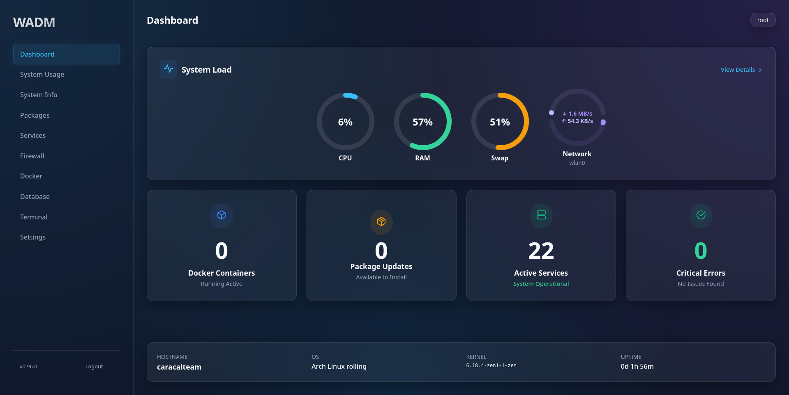

# WADM - Web Administration for Linux


WADM (Web Administration) is a modern, lightweight, and secure web-based control panel for Linux systems. It provides a beautiful interface to manage your server, monitor performance, and control services, Docker containers, and packages.



**Note: This project is currently in active development.**

## Features

- **System Dashboard**: Real-time monitoring of CPU, Memory, Disk, Swap, and detailed Network usage (Upload/Download split).
- **Web Terminal**: Secure, SSH-like access to the system shell directly from the browser (requires Developer Mode).
- **Package Management**: Unified interface for apt, dnf, and pacman. Auto-detects your system's package manager.
- **Docker Management**: View, start, stop, and restart containers. Monitor per-container CPU and Memory usage.
- **Firewall Control**: Manage ufw rules with a visual interface.
- **Service Manager**: Start, stop, and restart systemd services. View service logs directly in the browser.
- **Process Manager**: View running processes with Task Manager style controls (Kill/Force Kill).
- **Settings & Security**:
  - Secure Authentication with 2FA (TOTP) enforcement.
  - Developer Mode to gate advanced features like the Terminal.
  - Sudo privilege detection and warning.

## Technology Stack

- **Backend**: Rust (Actix-web, Bollard, Sysinfo, Portable-PTY)
- **Frontend**: React, TypeScript, Vite, Recharts, Xterm.js
- **Styling**: Vanilla CSS (Glassmorphism design)

## Installation from Release

To install WADM using the pre-built binaries, follow these steps:

1.  **Download the Release**:
    Go to the Releases page and download the suitable release archive for your architecture.

2.  **Extract the Archive**:
    Extract the contents of the downloaded archive to your desired location.
    ```bash
    tar -xf release.tar.xz
    cd release
    ```

3.  **Run the Application**:
    Execute the binary with root privileges to ensure full functionality (required for service and package management).
    ```bash
    sudo ./wadm
    ```

4.  **Access the Dashboard**:
    Open your web browser and navigate to http://localhost:8168.
    Follow the on-screen prompts to complete the initial setup and 2FA configuration.

## Build from Source

If you prefer to build the project from source, ensure you have the necessary prerequisites installed.

### Prerequisites

- **Rust**: Install Rust
- **Node.js**: Install Node.js (v18+)
- **System Dependencies**: Ensure libssl-dev (Ubuntu) or openssl-devel (Fedora) is installed.
  - Optional: ufw for firewall management, docker for container management.

### Build Steps

1. **Clone the repository:**
    ```bash
    git clone https://github.com/angrytisback/WADM.git
    cd WADM
    ```

2. **Build the Frontend:**
    ```bash
    cd web
    npm install
    npm run build
    cd ..
    ```
    *Note: The backend is configured to serve static files from web/dist.*

3. **Run the Backend:**
    ```bash
    cargo run --release
    ```
    *Note: You may need root privileges for certain features (Service control, Package management).*
    ```bash
    sudo ./target/release/wadm
    ```

## Contributing

Contributions are welcome! Please feel free to submit a Pull Request.

1.  Fork the Project
2.  Create your Feature Branch
3.  Commit your Changes
4.  Push to the Branch
5.  Open a Pull Request

## License

This project is licensed under the MIT License - see the LICENSE file for details.
