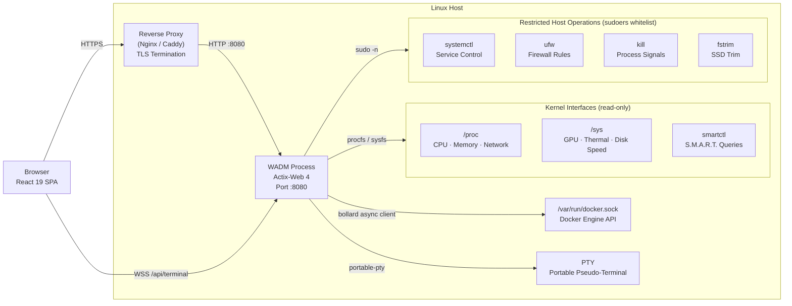

# WADM — Web Administration for Linux

[](https://github.com/angrytisback/WADM/actions/workflows/ci.yml)
[](https://github.com/angrytisback/WADM/actions/workflows/security.yml)
[](https://github.com/angrytisback/WADM/releases/latest)
[](LICENSE)
[](https://www.rust-lang.org/)
[](https://github.com/angrytisback/WADM/pkgs/container/wadm)

WADM is a self-hosted Linux server administration panel built on Actix-Web 4 and React 19. It delivers real-time system telemetry, Docker orchestration, one-click application deployments, a PTY-backed web terminal, and an integrated file manager — packaged as a single statically-linked binary with an embedded SPA frontend.

The architecture is deliberately minimal: no external database, no metrics agents, no sidecar processes. All telemetry is sourced directly from Linux kernel interfaces (`/proc`, `/sys`, Docker Unix socket). Memory footprint under typical load is below 40 MB.

---

## Architecture


```mermaid
flowchart LR
    Browser["Browser\nReact 19 SPA"]

    subgraph Host["Linux Host"]
        RP["Reverse Proxy\n(Nginx / Caddy)\nTLS Termination"]
        WADM["WADM Process\nActix-Web 4\nPort :8080"]

        subgraph Kernel["Kernel Interfaces (read-only)"]
            PROC["/proc\nCPU · Memory · Network"]
            SYS["/sys\nGPU · Thermal · Disk Speed"]
            SMART["smartctl\nS.M.A.R.T. Queries"]
        end

        subgraph Restricted["Restricted Host Operations (sudoers whitelist)"]
            SYSD["systemctl\nService Control"]
            UFW["ufw\nFirewall Rules"]
            KILL["kill\nProcess Signals"]
            FSTRIM["fstrim\nSSD Trim"]
        end

        DOCKER["/var/run/docker.sock\nDocker Engine API"]
        PTY["PTY\nPortable Pseudo-Terminal"]
    end

    Browser -- "HTTPS" --> RP
    RP -- "HTTP :8080" --> WADM
    Browser -- "WSS /api/terminal" --> WADM

    WADM -- "procfs / sysfs" --> Kernel
    WADM -- "bollard async client" --> DOCKER
    WADM -- "sudo -n" --> Restricted
    WADM -- "portable-pty" --> PTY
```

---

## Feature Matrix

| Capability                          | WADM                            | Cockpit            | Webmin             |
|-------------------------------------|---------------------------------|--------------------|--------------------|
| Runtime language                    | Rust (Actix-Web 4)              | C + JavaScript     | Perl               |
| Frontend                            | React 19 SPA (Vite 7)          | PatternFly (React) | Bootstrap          |
| External database required          | No                              | No                 | No                 |
| Metrics collection agent            | None (direct procfs/sysfs)      | None               | None               |
| Docker socket integration           | Yes (bollard, async)            | Partial (podman)   | Plugin-based       |
| One-click application deployments   | Yes (Compose templates)         | No                 | No                 |
| PTY web terminal                    | Yes (xterm.js + portable-pty)   | Yes                | Yes                |
| Cross-compilation targets           | x86_64, aarch64, riscv64       | x86_64, aarch64    | x86_64             |
| Typical idle memory                 | < 40 MB                         | ~80 MB             | ~60 MB             |
| Static binary (no runtime deps)     | Yes                             | No                 | No                 |
| Apache-2.0 licensed                 | Yes                             | LGPL-2.1           | GPL-3.0            |

---

## Core Features

### Real-Time System Telemetry

Metrics are collected directly from kernel interfaces with no agents or exporters. The polling interval is user-configurable (1 s, 2 s, or 5 s) and stored in the browser. CPU usage per core, memory and swap consumption, disk partition utilization, and live network throughput (RX/TX KB/s) are displayed on an auto-scrolling 60-point history chart.

Multi-vendor GPU support is implemented natively:
- NVIDIA: `nvidia-smi` CSV query
- AMD: `/sys/class/drm/<card>/device/gpu_busy_percent`, `mem_info_vram_*`
- Intel: sysfs frequency ratio (`gt_act_freq_mhz / gt_max_freq_mhz`)
- CPU temperature: `/sys/class/thermal/thermal_zone*`

### One-Click App Store

Pre-configured Docker Compose templates for common server applications:

| Application         | Ports             |
|---------------------|-------------------|
| Nextcloud           | 8080              |
| Pi-hole             | 53, 8081          |
| WordPress + MariaDB | 8082              |
| Nginx Proxy Manager | 8084, 8085, 8443  |
| Portainer CE        | 9000, 9443        |

Before installation, WADM checks for port conflicts using `TcpListener::bind`. Passwords are generated with a cryptographically secure RNG (`rand::thread_rng`), written to `credentials.txt` with `0o600` permissions, and retrievable through the credentials API endpoint at any time.

### Docker Orchestration

Communicates with the Docker Engine through the Unix socket via the `bollard` async client. Provides container lifecycle management (start, stop, restart, remove), real-time per-container CPU and memory statistics, port mapping visibility, and image metadata.

### PTY-Backed Web Terminal

An interactive shell session accessible through the browser using `xterm.js` and `xterm-addon-fit`. The backend allocates a pseudo-terminal via `portable-pty` and bridges it over a WebSocket connection (`actix-ws`). The terminal connects lazily: the PTY is only allocated when the terminal panel is opened and is released when it is closed.

Developer Mode, which exposes the terminal, requires explicit activation in the Settings panel and is disabled by default.

### Integrated File Manager and Editor

Hierarchical file system navigation with inline metadata (permissions, size, modification time). Supports file upload (multipart, with path traversal and null-byte sanitization), download, and in-browser editing for text files up to 10 MB. Sensitive system paths are blocked at the kernel guard layer in `src/api/files.rs`.

---

## Screenshots

| Dashboard | App Store |
|-----------|-----------|
|  |  |

| Docker Manager | Web Terminal |
|----------------|--------------|
|  |  |

| File Manager | System Services |
|--------------|-----------------|
|  |  |

---

## Installation

### Docker Compose (Recommended)

```bash
curl -fsSL https://raw.githubusercontent.com/angrytisback/WADM/main/docker-compose.yml -o docker-compose.yml
docker compose up -d
```

Access the panel at `http://<server-ip>:8080`. On first run, WADM displays a setup wizard to configure administrator credentials and 2FA.

To place WADM behind a reverse proxy with TLS, add a Nginx or Caddy upstream block pointing to port 8080 and terminate SSL at the proxy.

### Bare-Metal Installation (systemd)

```bash
curl -fsSL https://raw.githubusercontent.com/angrytisback/WADM/main/scripts/install.sh | sudo sh
```

The script:
1. Detects the host architecture (`x86_64`, `aarch64`, or `riscv64`).
2. Downloads the latest release binary from GitHub Releases.
3. Creates a dedicated `wadm` system user with no login shell.
4. Installs `/etc/systemd/system/wadm.service` with hardened process sandboxing.
5. Installs `/etc/sudoers.d/wadm` with a strict command whitelist.
6. Enables and starts the service.

**Manual install** (without piping to shell):

```bash
# Download the script and inspect it before executing
curl -fsSL https://raw.githubusercontent.com/angrytisback/WADM/main/scripts/install.sh -o install.sh
less install.sh
sudo sh install.sh
```

### Building from Source

Prerequisites: Rust stable 1.80+, Node.js 20+, npm 10+.

```bash
git clone https://github.com/angrytisback/WADM.git
cd WADM

# Build frontend
cd web && npm ci && npm run build && cd ..

# Build backend (release)
cargo build --release

# Run (serves frontend from ./web/dist)
./target/release/wadm
```

---

## Security Architecture

### Authentication

- **Credentials**: Stored in `wadm-auth.json` as Argon2id hashes (never plaintext).
- **Two-Factor Authentication**: TOTP (RFC 6238) with QR code enrollment. Enforced on every login after setup.
- **Session Tokens**: Short-lived JWTs signed with a 32-byte cryptographically random secret generated on first launch and stored in `.wadm_jwt_secret` (`0o600`).
- **Rate Limiting**: In-memory IP-based rate limiter with configurable thresholds. Expired entries are pruned periodically to prevent memory growth.

### Privilege Model

WADM runs as the `wadm` system user. Host-level operations (service control, firewall rules, process signals, disk trim) are delegated through `sudo -n` to a whitelist defined in `/etc/sudoers.d/wadm`. The whitelist grants access to specific binaries only; `NOPASSWD ALL` is never used.

### Filesystem Sandbox

All file manager operations are validated against a blocklist of sensitive paths and patterns:
- Blocked reads: `/etc/shadow`, `/etc/gshadow`, `/etc/sudoers`, `.wadm_jwt_secret`, `wadm-auth.json`
- Blocked write directories: `/proc`, `/sys`, `/dev`, `/etc/sudoers.d`
- All paths are resolved and checked for `..` traversal and null-byte sequences before I/O.

### Developer Mode (Web Terminal)

Disabled by default. When enabled, the panel exposes an interactive shell session over WebSocket. This is an intentional high-privilege feature and must only be enabled on networks with restricted access. The capability is visible in the Settings panel with an explicit risk warning.

---

## API Overview

All API endpoints require a valid JWT in the `Authorization: Bearer <token>` header, obtained from `POST /api/auth/login`.

| Method | Endpoint                          | Description                            |
|--------|-----------------------------------|----------------------------------------|
| POST   | /api/auth/login                   | Authenticate and receive JWT           |
| GET    | /api/stats                        | System telemetry snapshot              |
| GET    | /api/processes                    | Running process list (top 50 by CPU)   |
| POST   | /api/processes/kill               | Send SIGTERM or SIGKILL to a PID       |
| GET    | /api/services                     | List systemd units                     |
| POST   | /api/services/{name}/{action}     | start / stop / restart / enable        |
| GET    | /api/apps                         | List available App Store templates     |
| POST   | /api/apps/install                 | Deploy a template via Docker Compose   |
| GET    | /api/apps/{id}/credentials        | Retrieve generated app credentials     |
| POST   | /api/apps/{id}/uninstall          | Remove containers, volumes, and data   |
| GET    | /api/docker/containers            | List Docker containers with stats      |
| POST   | /api/docker/{id}/{action}         | start / stop / restart / remove        |
| GET    | /api/files/list                   | Directory listing                      |
| POST   | /api/files/upload                 | Multipart file upload                  |
| GET    | /api/files/download               | File download by path                  |
| WS     | /api/terminal                     | PTY WebSocket (Developer Mode only)    |

---

## Contributing

See [CONTRIBUTING.md](CONTRIBUTING.md) for development setup, quality gates, and the pull request process.

## Security

See [SECURITY.md](SECURITY.md) for the vulnerability disclosure policy and supported version matrix.

## License

Apache License 2.0. See [LICENSE](LICENSE) for the full text.
