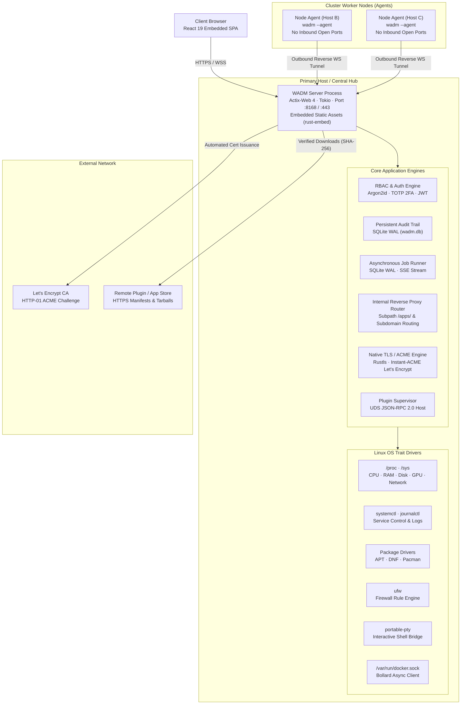

# WADM — Web Administration for Linux

[](https://github.com/angrytisback/WADM/actions/workflows/ci.yml)
[](https://github.com/angrytisback/WADM/actions/workflows/security.yml)
[](https://github.com/angrytisback/WADM/releases/latest)
[](LICENSE)
[](https://www.rust-lang.org/)
[](https://github.com/angrytisback/WADM/pkgs/container/wadm)

WADM is a lightweight, high-performance, single-binary Linux server administration control plane built with Actix-Web 4, Tokio, and React 19. It delivers real-time kernel telemetry, multi-distribution package management, systemd service supervision, Docker container orchestration, a zero-port-exposure application store, an out-of-process plugin host, native TLS/ACME termination, and multi-node cluster federation via reverse WebSocket tunnels.

The platform requires zero external runtimes (no Python, Node.js, or JVM). All telemetry is sourced directly from Linux kernel virtual filesystems (`/proc`, `/sys`) and the Docker Unix domain socket. Typical idle memory footprint remains below 40 MB.

---

## Architecture


```mermaid
flowchart TD
    Browser["Client Browser\nReact 19 Embedded SPA"]

    subgraph CentralHost["Primary Host / Central Hub"]
        WADM["WADM Server Process\nActix-Web 4 · Tokio · Port :8168 / :443\nEmbedded Static Assets (rust-embed)"]

        subgraph CoreEngines["Core Application Engines"]
            AUTH["RBAC & Auth Engine\nArgon2id · TOTP 2FA · JWT"]
            AUDIT["Persistent Audit Trail\nSQLite WAL (wadm.db)"]
            JOB["Asynchronous Job Runner\nSQLite WAL · SSE Stream"]
            RPROXY["Internal Reverse Proxy Router\nSubpath /apps/ & Subdomain Routing"]
            TLS["Native TLS / ACME Engine\nRustls · Instant-ACME Let's Encrypt"]
            PLUGIN["Plugin Supervisor\nUDS JSON-RPC 2.0 Host"]
        end

        subgraph HostDrivers["Linux OS Trait Drivers"]
            PROC["/proc · /sys\nCPU · RAM · Disk · GPU · Network"]
            SYSD["systemctl · journalctl\nService Control & Logs"]
            PKGMGR["Package Drivers\nAPT · DNF · Pacman"]
            UFW["ufw\nFirewall Rule Engine"]
            PTY["portable-pty\nInteractive Shell Bridge"]
            DOCKER["/var/run/docker.sock\nBollard Async Client"]
        end
    end

    subgraph ClusterNodes["Cluster Worker Nodes (Agents)"]
        AGENT1["Node Agent (Host B)\nwadm --agent\nNo Inbound Open Ports"]
        AGENT2["Node Agent (Host C)\nwadm --agent\nNo Inbound Open Ports"]
    end

    subgraph ExternalServices["External Network"]
        ACME["Let's Encrypt CA\nHTTP-01 ACME Challenge"]
        STORE["Remote Plugin / App Store\nHTTPS Manifests & Tarballs"]
    end

    Browser -- "HTTPS / WSS" --> WADM
    WADM --> CoreEngines
    CoreEngines --> HostDrivers

    AGENT1 -- "Outbound Reverse WS Tunnel" --> WADM
    AGENT2 -- "Outbound Reverse WS Tunnel" --> WADM

    WADM -- "Automated Cert Issuance" --> ACME
    WADM -- "Verified Downloads (SHA-256)" --> STORE
```

---

## Feature Matrix

| Capability                          | WADM                            | Cockpit            | Webmin             |
|-------------------------------------|---------------------------------|--------------------|--------------------|
| Runtime Language                    | Rust (Actix-Web 4 & Tokio)      | C + JavaScript     | Perl               |
| Frontend                            | React 19 SPA (Vite 7)          | PatternFly (React) | Bootstrap          |
| External Runtime Dependencies       | None (Self-contained binary)    | Node/Python deps   | Perl modules       |
| Telemetry Engine                    | Direct `/proc` & `/sys`         | PCP / systemd      | System commands    |
| Container Orchestration             | Native async Docker socket      | Podman integration | Plugin-based       |
| App Store Deployment Model          | Zero Port Exposure + Rev Proxy  | Manual config      | Manual config      |
| Extension / Plugin Model            | UDS JSON-RPC 2.0 (Out-of-Proc)  | In-process bridge  | Perl scripts       |
| Multi-Node Cluster Federation       | Reverse WebSocket Tunnels       | SSH bastion / keys | SSH bastion / keys |
| Inbound Ports Required for Agents   | 0 (Outbound tunnel only)        | Requires SSH/Port  | Requires Port      |
| Background Job Runner               | SQLite WAL + SSE Streaming      | None               | Background Cron    |
| Native TLS & Let's Encrypt          | Built-in Rustls + Instant-ACME  | Requires Proxy     | OpenSSL scripts    |
| Multi-User RBAC & Audit Trail       | Built-in (Viewer/Op/Admin)      | PAM / OS users     | Webmin ACLs        |
| Cross-Compilation Targets           | x86_64, aarch64                 | Distro packages    | Architecture indep |
| Typical Idle Memory                 | < 40 MB                         | ~80 MB             | ~60 MB             |
| License                             | Apache-2.0                      | LGPL-2.1           | BSD-3-Clause       |

---

## Core Capabilities

### 1. Real-Time Telemetry & Hardware Inspection
- **CPU & Thermal:** Per-core utilization, hardware clock rates, and package temperatures sourced from `sysinfo` and `/sys/class/hwmon`.
- **Memory & Swap:** Physical RAM metrics (Total, Used, Free, Cached, Available) and swap utilization.
- **Network Throughput:** RX/TX throughput (KB/s, MB/s) with a rolling 60-point historical telemetry series.
- **Multi-Vendor GPU Support:** Hardware-native sensors for NVIDIA (`nvidia-smi`), AMD (`/sys/class/drm` and sysfs counters), and Intel (`intel_gpu_top` / sysfs frequency ratios).
- **S.M.A.R.T. Health:** Physical drive telemetry, wear levels, power-on hours, and operational temperatures via `smartctl --scan --json`.

### 2. Zero-Port-Exposure App Store & Internal Reverse Proxy
- **Strict Network Isolation:** Deployed applications (Nextcloud, Jellyfin, Vaultwarden, Pi-hole, WordPress, Nginx Proxy Manager, Portainer) bind strictly to `127.0.0.1:<internal_port>` or private container networks. Public ports (`0.0.0.0:PORT`) are never exposed.
- **Internal Reverse Proxy Router:** Web interfaces are exposed securely through WADM's primary HTTP/HTTPS listener via:
  - Subpath routing: `https://panel.example.com/apps/<app-id>/`
  - Subdomain routing: `https://<app-id>.panel.example.com`
- **Firewall Consent Modal:** Applications requiring non-HTTP network protocols (e.g. DNS UDP/53, WireGuard UDP/51820) require explicit administrator approval via an interactive consent modal before updating UFW firewall rules.
- **Cryptographic Credentials:** Passwords generated via `rand::thread_rng` are stored in `credentials.txt` with mode `0o600`.

### 3. Out-of-Process Plugin Host & Store
- **Fault-Isolated Execution:** Plugins run as independent child processes communicating over Unix Domain Sockets using JSON-RPC 2.0. A plugin failure cannot crash or destabilize the main control plane.
- **Cryptographic Security:** Plugin archives downloaded from remote stores are verified against published SHA-256 digests prior to extraction.
- **Zip-Slip Protection:** Path sanitization strictly rejects archive entries containing `..` or absolute paths.

### 4. Cluster Federation & Headless Node Agents
- **Outbound Reverse WebSocket Tunnels:** Remote worker nodes connect to the central Hub via `/api/cluster/tunnel`. Nodes require zero public inbound ports or firewall forwarding.
- **Central Dispatching:** The central Hub seamlessly routes telemetry requests, container controls, and service operations to remote nodes over the established tunnel.
- **Heartbeat & Liveness Checks:** Automatic 15-second heartbeat ping/pong protocol marks unreachable nodes offline.
- **Headless Agent Mode:** Run WADM on remote nodes with:
  ```bash
  wadm --agent --hub-url ws://hub.example.com:8168/api/cluster/tunnel --token <join-token> --name node-01
  ```

### 5. Asynchronous Job Runner & SSE Streaming
- **Persistent Job State:** Long-running operations (package updates, app deployments, backups) run in background Tokio tasks tracked in SQLite (`wadm.db`) under write-ahead logging (WAL).
- **Live Terminal Streaming:** Real-time log outputs stream to client browsers via Server-Sent Events (`GET /api/jobs/{id}/stream`).

### 6. Native Dual-Stack TLS & Automated ACME Let's Encrypt
- **Rustls Server:** Direct TLS termination without requiring Nginx, Caddy, or Apache.
- **Automated Let's Encrypt:** Automated HTTP-01 challenge completion and background certificate renewal within 30 days of expiration.
- **Self-Signed Fallback:** Automatic generation of ECDSA P-256 self-signed certificates for air-gapped or private network installations.

### 7. Multi-User RBAC & Audit Logging
- **Role Hierarchy:**
  - `Viewer`: Read-only telemetry and health monitoring.
  - `Operator`: Service management, container control, memory flushing, and database backups.
  - `Admin`: Full supervisory control, user management, terminal shell access, and plugin administration.
- **Persistent Audit Log:** Every sensitive administrative action is logged to SQLite with timestamps, client IP addresses, usernames, and action statuses.

### 8. Interactive Web Terminal (Web TTY)
- **High-Performance Console:** Terminal emulation via `@xterm/xterm` v6.x and `@xterm/addon-fit`.
- **PTY Lifecycle Management:** Lazy pseudo-terminal allocation via `portable-pty` over WebSocket (`actix-ws`).
- **Child Process Reaper:** Active process supervision terminates child shells (`SIGKILL` and process reaping) when WebSocket connections disconnect, preventing zombie processes.

---

## Installation

### Automated Production Install (Recommended)

Run the production installer script on your Linux host:

```bash
curl -sSL https://raw.githubusercontent.com/angrytisback/WADM/main/scripts/install.sh | sudo bash
```

The installer:
1. Detects host architecture (`x86_64` or `aarch64`).
2. Fetches the latest release archive and extracts the statically-linked `wadm` binary to `/usr/local/bin/wadm`.
3. Creates a dedicated `wadm` system user with no interactive login shell.
4. Creates persistent directories (`/var/lib/wadm`, `/run/wadm`) with secure permissions.
5. Installs `/etc/sudoers.d/wadm` granting least-privilege command access.
6. Installs and enables the hardened `wadm.service` systemd unit.

### Installing a Cluster Node Agent

To deploy a headless cluster node agent that connects back to your central WADM panel:

```bash
curl -sSL https://raw.githubusercontent.com/angrytisback/WADM/main/scripts/install.sh | sudo bash -s -- \
  --agent \
  --hub-url ws://hub.example.com:8168/api/cluster/tunnel \
  --token <join-token> \
  --name worker-fra-01
```

### Docker Deployment

To deploy WADM via Docker:

```bash
docker run -d \
  --name wadm \
  --restart unless-stopped \
  --privileged \
  --pid=host \
  --network=host \
  -v /var/run/docker.sock:/var/run/docker.sock \
  -v /var/lib/wadm:/var/lib/wadm \
  -v /run/systemd:/run/systemd \
  ghcr.io/angrytisback/wadm:latest
```

> **Note:** WADM manages host-level system resources (CPU, RAM, Docker, storage). Running with `--pid=host`, `--network=host`, and mounting the Docker socket allows the containerized binary to inspect host processes and container topologies.

### Building from Source

#### Prerequisites
- Rust stable toolchain (1.80 or newer)
- Node.js (v20 LTS or newer) and npm (v10 or newer)
- Linux build dependencies: `build-essential` (or `base-devel`)

#### Compilation
```bash
git clone https://github.com/angrytisback/WADM.git
cd WADM

# 1. Build frontend static assets (required before Rust compile)
cd web && npm ci && npm run build && cd ..

# 2. Compile release binary with embedded assets
cargo build --release

# 3. Launch WADM
./target/release/wadm
```

The panel will bind to `0.0.0.0:8168` by default. On first launch, navigate to `http://<server-ip>:8168` to complete initial administrator account creation and 2FA enrollment.

---

## Security Model

### Authentication & Secrets
- **Password Hashing:** Passwords are verified using Argon2id with cryptographically random salts.
- **Two-Factor Authentication:** TOTP (RFC 6238) enforced across all administrative accounts.
- **Session Tokens:** Dynamically generated 256-bit JWT secret saved to `.wadm_jwt_secret` with mode `0o600`.
- **Brute-Force Protection:** In-memory rate limiter enforcing a maximum of 5 failed login attempts per minute per IP address.

### Filesystem Sandboxing
All file manager and editor endpoints validate paths against strict security guards:
- **Blocked Reads:** `/etc/shadow`, `/etc/gshadow`, `/etc/sudoers`, SSH private keys, and `.wadm_jwt_secret`.
- **Blocked Writes:** `/proc`, `/sys`, `/dev`, `/boot`, and `/etc/sudoers.d`.
- **Path Traversal Shield:** Canonical path verification rejects any path containing `..` or null-byte characters.

### Privilege Model
The WADM binary runs under a dedicated `wadm` system user. Host operations (service manipulation, firewall updates, process signals, SSD trimming) are delegated through `sudo -n` against an explicit binary whitelist in `/etc/sudoers.d/wadm`. Broad `NOPASSWD: ALL` grants are never used.

---

## API Reference

All API routes (except `/api/auth/login` and `/api/auth/setup`) require a valid JWT passed in the `Authorization: Bearer <token>` header.

| Method | Endpoint                          | Role Required | Description                                  |
|--------|-----------------------------------|---------------|----------------------------------------------|
| POST   | `/api/auth/login`                 | Public        | Authenticate credentials and TOTP code       |
| GET    | `/api/stats`                      | Viewer        | Real-time system telemetry snapshot          |
| GET    | `/api/processes`                  | Viewer        | Running process list                         |
| POST   | `/api/processes/kill`             | Operator      | Send SIGTERM or SIGKILL to a PID             |
| GET    | `/api/services`                   | Viewer        | List systemd unit states                     |
| POST   | `/api/services/{name}/{action}`   | Operator      | Manage service lifecycle                     |
| GET    | `/api/docker/containers`          | Viewer        | List Docker containers and stats             |
| POST   | `/api/docker/{id}/{action}`       | Operator      | Start, stop, restart, or remove a container  |
| GET    | `/api/apps`                       | Viewer        | List App Store templates                     |
| POST   | `/api/apps/install`               | Admin         | Deploy an App Store container stack          |
| GET    | `/api/apps/{id}/credentials`      | Admin         | Retrieve credentials for a deployed app      |
| POST   | `/api/apps/{id}/uninstall`        | Admin         | Uninstall an application stack and volumes   |
| GET    | `/api/jobs/{id}/stream`           | Viewer        | Server-Sent Events stream for background job |
| GET    | `/api/cluster/nodes`              | Viewer        | List federated cluster nodes                 |
| POST   | `/api/cluster/nodes`              | Admin         | Register a new cluster node                  |
| WS     | `/api/cluster/tunnel`             | Node Agent    | Outbound reverse WebSocket agent tunnel      |
| GET    | `/api/plugins`                    | Viewer        | List installed plugins and status            |
| POST   | `/api/plugins/{id}/install`       | Admin         | Install plugin from store or URL             |
| GET    | `/api/audit/logs`                 | Admin         | Query and export persistent audit trail      |
| WS     | `/api/terminal`                   | Admin         | Interactive PTY WebSocket shell session      |

---

## Uninstallation

To remove WADM from your server:

```bash
sudo /usr/local/bin/wadm --uninstall 2>/dev/null || sudo bash scripts/uninstall.sh
```

To completely purge all persistent configuration, databases, SSL certificates, and application data:

```bash
sudo bash scripts/uninstall.sh --purge
```

---

## Contributing

See [CONTRIBUTING.md](CONTRIBUTING.md) for local development setup, coding standards, and testing procedures.

## Security

See [SECURITY.md](SECURITY.md) for vulnerability reporting guidelines and supported version details.

## License

Apache License 2.0. See [LICENSE](LICENSE) for details.
