# WADM (Web Administration for Linux) - Proje Mimarisi ve Bağlam Haritası (Architecture & Context Reference)

> **Sürüm Referansı:** v0.96.0 | **Mimari Standart:** Hexagonal / Clean Layered REST & WebSocket | **Son Güncelleme:** Eylül 2026  
> **Hedef Kitle:** Kıdemli Yazılım Mimarları, Güvenlik Denetçileri, Sistem Programcıları ve AI Mühendislik Ajanları

---

## 1. Sistem Özeti (System Overview)

### 1.1. Vizyon ve Temel Amaç
**WADM (Web Admin for Linux)**; Linux tabanlı sunucuların uzaktan yönetimi, gerçek zamanlı telemetrisi, sistem seviyesinde donanım ve bellek optimizasyonu, paket/servis yönetimi, konteyner (Docker) ve ilişkisel veritabanı (MySQL/PostgreSQL) orkestrasyonu için geliştirilmiş **hafif (lightweight)**, **yüksek performanslı** ve sıfır çalışma zamanı bağımlılığına (Python, Node.js veya JVM gerektirmeyen) sahip yeni nesil bir web kontrol panelidir.

Cockpit veya Webmin gibi geleneksel araçların hantal mimarilerine, karmaşık bağımlılık zincirlerine ve yüksek bellek tüketimlerine karşı modern bir alternatif sunar. Çekirdeğinde güvenli ve doğrudan makine koduna derlenen **Rust (Actix-Web 4 & Tokio)** motoru çalışırken; kullanıcı arayüzünde modern, reaktif ve cam morfolojisi (glassmorphism) tasarım diline sahip **React 19 / TypeScript / Vite 7** tek sayfa uygulaması (SPA) yer alır.

### 1.2. Dağıtım ve Çalıştırma Modeli
- **Backend İkilisi (`wadm`):** Doğrudan Linux çekirdeği sanal dosya sistemleri (`/proc`, `/sys`), systemd D-Bus/CLI araçları, Docker Unix soketi (`/var/run/docker.sock`) ve POSIX PTY altyapısı ile konuşan tekil bir ELF ikilisidir.
- **Frontend Statik Varlıkları (`./web/dist`):** Vite 7 ile üretilen optimize edilmiş HTML, CSS ve JS paketleridir. Backend sunucusu (`src/main.rs:105-108`) bu dizini `/` kök yolundan doğrudan servis eder.
- **Çoklu Mimari Desteği (`build.sh`):** Proje `cross` derleme aracı ile `linux-amd64`, `linux-arm64` (aarch64), `linux-riscv64` ve `windows-x64` mimarileri için bağımsız ikililer üretebilmektedir.

### 1.3. Temel Fonksiyonel Yetenekler
1. **Gerçek Zamanlı Donanım ve Sistem Telemetrisi:**
   - **İşlemci (CPU):** Çekirdek bazında anlık yük, frekans ve paket sıcaklıkları (`sysinfo`, `/sys/class/thermal`, `/sys/class/hwmon`).
   - **Bellek (RAM) ve Takas (Swap):** Kullanılan, önbelleğe alınan ve serbest bellek metrikleri; anlık takas alanı izleme.
   - **Depolama (Disk):** Mount edilmiş tüm dosya sistemleri, toplam/kullanılan alan tespiti, doluluk oranları.
   - **Ağ I/O:** Varsayılan aktif arayüz üzerinden saniyelik RX/TX indirme/yükleme hızları (KB/s, MB/s) ve arayüz bant genişliği.
   - **Hibrit Donanımsal GPU Tespiti:** NVIDIA (`nvidia-smi`), AMD (`sysfs/drm` doğrudan sayaçları) ve Intel (`intel_gpu_top` / sysfs frekans oranı) kartlarının VRAM, çekirdek yükü ve sıcaklık değerleri.
   - **S.M.A.R.T. Disk Sağlığı:** `smartctl --scan --json` entegrasyonu ile bağlı depolama aygıtlarının çalışma süresi (Power-on Hours), sıcaklık ve sağlık durumu.

2. **Sistem Bakımı ve Bellek Yönetimi (Maintenance Protocols):**
   - **Bellek / RAM Boşaltma (Memory Flush):** `sync` ve `/proc/sys/vm/drop_caches (mode 3)` ile PageCache, dentries ve inode önbelleklerinin serbest bırakılması.
   - **Paket ve Journal Önbelleği Temizliği (Cache Clean):** APT/DNF/Pacman yerel önbelleklerinin temizlenmesi ve 3 günden eski systemd journal loglarının vakumlanması (`journalctl --vacuum-time=3d`).
   - **OOM Korumalı Takas Alanı Boşaltma (Swap Flush):** Yeterli serbest fiziksel bellek olması durumunda (`avail_kb >= swap_used + 150MB`) takas alanındaki verilerin belleğe geri yüklenmesi (`swapoff -a && swapon -a`).
   - **SSD TRIM Protokolü:** `fstrim -av` ile blok depolama aşınma optimizasyonu.
   - **DNS Önbelleği Yönetimi:** `resolvectl` / `systemd-resolve` istatistikleri ve anlık önbellek temizliği (`flush-caches`).
   - **WAN Bant Genişliği Testi (Speedtest):** Sistemde kurulu `speedtest-cli` veya `speedtest` aracı ile indirme, yükleme ve ping ölçümü.

3. **Paket ve Servis Yönetimi:**
   - **Çoklu Paket Yöneticisi Desteği:** APT (Debian/Ubuntu), DNF (Fedora/RHEL) ve Pacman (Arch Linux) otomatik tespiti (`detect_manager`).
   - **Paket Yaşam Döngüsü:** Güncellenebilir paket listesi, tekil paket yükseltme, toplu yükseltme (`update-all`), yeni paket arama/kurma ve bağımlılık önizlemeli güvenli kaldırma (`remove-dry-run`).
   - **Bağımlılık Denetimi (Dependency Check):** Sistemde eksik olan CLI araçlarının (`smartctl`, `ufw`, `docker`, `sensors` vb.) tespiti ve tek tıkla arayüzden kurulması.
   - **Systemd Servis Kontrolü:** Çalışan (`list-units`) ve kurulu (`list-unit-files`) tüm servislerin listelenmesi; `start`, `stop`, `restart`, `enable`, `disable` operasyonları ve anlık 100 satırlık `journalctl` log akışı.

4. **Konteyner ve Uygulama Yönetimi (Docker & App Store):**
   - **Docker API Entegrasyonu:** Bollard kütüphanesi ile `/var/run/docker.sock` üzerinden asenkron konteyner listeleme, canlı CPU/RAM kullanım metrikleri ve lifecycle kontrolü (`start`, `stop`, `restart`, `remove`).
   - **App Store (Hazır Uygulama Kataloğu):** Nextcloud, Pi-hole, WordPress gibi popüler sunucu servislerinin tek tıkla Docker Compose üzerinden izole ayağa kaldırılması ve kriptografik rastgele güvenli parolaların (`rand`) üretilmesi.

5. **İlişkisel Veritabanı Yönetimi (Database Management):**
   - **Çoklu Motor & Ortam Desteği:** Hem yerel (Host) hem de Docker konteynerleri içinde koşan MySQL/MariaDB ve PostgreSQL veritabanlarının otomatik keşfi.
   - **Veri Gezgini ve Sorgu Konsolu:** Veritabanı ve tablo listeleme, tablo verilerini sayfalı inceleme (`LIMIT 100`) ve SQL sorgu/mutasyon konsolu.
   - **Yedekleme ve Geri Yükleme:** `mysqldump` ve `pg_dump` entegrasyonu; güvenli dosya akışıyla (stream) yedek alma, geri yükleme (restore), yedek indirme ve SQL dosyası yükleme (upload).

6. **Gelişmiş Dosya Yöneticisi (File Explorer):**
   - Sunucu dosya sisteminde hiyerarşik dizin gezintisi, dosya boyutları, POSIX izinleri (`rwxrwxrwx`) ve değişiklik tarihleri.
   - 10 MB'a kadar metin tabanlı yapılandırma dosyalarını tarayıcı içinden düzenleme ve kaydetme.
   - Dosya/klasör oluşturma, silme, multipart dosya yükleme ve güvenli ikili/metin dosya indirme (`download_file`).
   - Path traversal (`..`) ve kritik sistem yollarına yazmayı engelleyen katı güvenlik çiti (`validate_and_sanitize_path`).

7. **İnteraktif Web Terminali (Web TTY):**
   - Tarayıcı içinde çalışan VT100/Xterm emülatörü (`@xterm/xterm` v6.x) ve sunucu tarafında sanal terminal motoru (`portable-pty`).
   - `Sec-WebSocket-Protocol` subprotocol üzerinden taşınan JWT doğrulaması.
   - Geliştirici Modu (`developer_mode`) ile yetkilendirilmiş root kabuk (bash) oturumu ve dinamik ekran boyutu senkronizasyonu (`RESIZE:colsxrows`).

8. **Güvenlik ve Kimlik Doğrulama:**
   - Yönetici parolası için endüstri standardı **Argon2id** şifreleme.
   - **RFC 6238 TOTP (Google Authenticator)** zorunlu iki aşamalı doğrulama (2FA).
   - Sunucu ilk açılışında `OsRng` ile üretilen ve `0600` izinleriyle saklanan 256-bit dinamik JWT anahtarı (`.wadm_jwt_secret`).
   - IP bazlı kaba kuvvet (brute-force) saldırı koruması (`LoginRateLimiter`: 60 saniyede maks 5 deneme).
   - UFW güvenlik duvarı durum denetimi ve kural yönetimi (`is_safe_ufw_rule`).
   - Donanımsal güç kontrolü (`reboot`, `shutdown`, `systemd-logind` zamanlanmış güç planı).

---

## 2. Mimari Tasarım ve Veri Akışı (Architecture & Data Flow)

### 2.1. Yüksek Seviye Bileşen Şeması (Component Diagram)

```mermaid
graph TD
    Client["Tarayıcı İstemcisi (React 19 + TypeScript + Vite 7 SPA)"]
    
    subgraph WADM_Server["WADM Server (Rust / Actix-Web :8168)"]
        HTTP_Engine["Actix Web Engine"]
        Cors_MW["CORS & Güvenlik Başlıkları Middleware"]
        Auth_MW["JWT Auth Middleware (src/middleware.rs)"]
        Static_Srv["Statik Dosya Sunucusu (web/dist)"]
        
        subgraph API_Controllers["API Kontrolcüleri (src/api/*)"]
            Auth_Ctrl["auth.rs (Argon2id + TOTP)"]
            Monitor_Ctrl["monitor.rs (Telemetri)"]
            System_Ctrl["system.rs (Bakım, Güç, SMART)"]
            Pkg_Ctrl["pkgmgr.rs (APT/DNF/Pacman)"]
            Svc_Ctrl["services.rs (Systemd)"]
            Docker_Ctrl["docker.rs (Bollard API)"]
            Db_Ctrl["db.rs (MySQL / Postgres)"]
            Files_Ctrl["files.rs (Dosya Yöneticisi)"]
            Fw_Ctrl["firewall.rs (UFW)"]
            Apps_Ctrl["apps.rs (App Store)"]
            Config_Ctrl["config.rs (Developer Mode)"]
            Logs_Ctrl["logs.rs (Bellek İçi Loglar)"]
        end
        
        PTY_Engine["Terminal Motoru (terminal.rs + portable-pty)"]
        
        subgraph In_Memory_State["Global Bellek Durumu (AppState & Singletons)"]
            State_Sys["Mutex&lt;sysinfo::System&gt;"]
            State_Net["Mutex&lt;sysinfo::Networks&gt;"]
            State_Auth["Mutex&lt;Option&lt;AuthStore&gt;&gt;"]
            State_Cfg["Mutex&lt;AppConfig&gt;"]
            State_Cache["UPGRADABLE_CACHE (5 dk TTL)"]
            State_Rate["LOGIN_RATE_LIMITER (Sliding Window)"]
            State_Logs["LOG_STORE (1000 Ring Buffer)"]
        end
    end
    
    subgraph Linux_Kernel_Userland["Linux İşletim Sistemi (Host Kernel & Userland)"]
        ProcFS["/proc, /sys (meminfo, drm, net, hwmon, thermal)"]
        Systemd_CLI["systemctl, journalctl, shutdown, reboot"]
        Docker_Daemon["/var/run/docker.sock (Docker Engine)"]
        Pkg_CLI["apt-get, dnf, pacman"]
        Db_CLI["mysql, psql, mysqldump, pg_dump"]
        Ufw_CLI["ufw (Uncomplicated Firewall)"]
        PTY_Subsystem["/dev/pts/* (Linux PTY Slave / Bash)"]
        Disk_SMART["smartctl (smartmontools)"]
    end

    Client -->|HTTP REST İstekleri| HTTP_Engine
    Client -->|WebSocket TTY /ws| HTTP_Engine
    HTTP_Engine --> Cors_MW
    Cors_MW --> Auth_MW
    Auth_MW -->|Geçerli JWT| API_Controllers
    Auth_MW -->|WebSocket Sec-WebSocket-Protocol| PTY_Engine
    HTTP_Engine -->|Kök İstek /| Static_Srv
    
    API_Controllers --> In_Memory_State
    PTY_Engine --> PTY_Subsystem
    
    Monitor_Ctrl --> State_Sys
    Monitor_Ctrl --> State_Net
    Monitor_Ctrl --> ProcFS
    Monitor_Ctrl --> State_Cache
    
    System_Ctrl --> ProcFS
    System_Ctrl --> Systemd_CLI
    System_Ctrl --> Disk_SMART
    
    Pkg_Ctrl --> Pkg_CLI
    Pkg_Ctrl --> State_Cache
    
    Svc_Ctrl --> Systemd_CLI
    Docker_Ctrl --> Docker_Daemon
    Db_Ctrl --> Db_CLI
    Db_Ctrl --> Docker_Daemon
    Files_Ctrl --> Linux_Kernel_Userland
    Fw_Ctrl --> Ufw_CLI
    Apps_Ctrl --> Docker_Daemon
    Logs_Ctrl --> State_Logs
```



---

### 2.2. Uçtan Uca İstek Hattı (Request Lifecycle Pipeline)

WADM sisteminde istemciden sunucuya gönderilen bir isteğin geçtiği 5 temel aşama:

1. **İstemci Hazırlığı (Client Interception):**
   - React tarafında tüm HTTP istekleri `AuthContext.tsx` içindeki monkey-patch edilmiş `window.fetch` interceptor'ından geçer.
   - Interceptor, hedef URL'nin içsel mi (`startsWith('/')` veya `window.location.origin`) olduğunu kontrol eder (`isInternalOrRelative`). Dış servislere token sızması engellenir.
   - Geçerli oturum varsa `Authorization: Bearer <token>` başlığı enjekte edilir.
   - Yanıt `401 Unauthorized` dönerse istemci anında `logout()` çağırarak oturumu sonlandırır.

2. **HTTP ve Güvenlik Başlıkları Katmanı (`src/main.rs`):**
   - **Port:** Varsayılan port `8168` olarak dinlenir (`main.rs:21`).
   - **CORS:** `WADM_ALLOWED_ORIGINS` ortam değişkenine bakar; boşsa sadece `localhost`, `127.0.0.1` ve `:8168` portlarına izin verir (`main.rs:67-87`).
   - **Security Headers:** Her HTTP yanıtına `nosniff`, `DENY` (clickjacking engeli), `strict-origin-when-cross-origin` ve boş `Permissions-Policy` başlıkları eklenir (`main.rs:94-100`).
   - **Loglama:** Actix Logger `REQ|%m|%U|%s` formatıyla devreye girer (`main.rs:101`).

3. **Yetkilendirme Middleware'i (`src/middleware.rs`):**
   - Beyaz listedeki rotalar (`/api/auth/status`, `/api/auth/login`, `/api/auth/setup/init`, `/api/auth/setup/confirm`, `/api/health`) doğrudan geçirilir (`middleware.rs:51-62`).
   - WebSocket rotası (`/api/terminal/ws`) için token önce `Sec-WebSocket-Protocol` başlığından, bulunamazsa `?token=` query parametresinden okunur (`middleware.rs:75-98`).
   - Standart REST çağrılarında `Authorization: Bearer <jwt>` aranır.
   - `JWT_SECRET` kullanılarak HS256 imzası, geçerlilik süresi (`exp`) ve ihraç tarihi (`iat`) doğrulanır. Başarısız ise istek controller'a varmadan `401 Unauthorized` ile kesilir.

4. **İş Mantığı ve OS Yürütme Katmanı (`src/api/*`):**
   - Girdi parametreleri regex, whitelist veya path sanitization süzgecinden geçirilir.
   - Salt veri okuma istekleri `sysinfo` ve `/proc`, `/sys` sanal dosya sistemlerinden toplanır.
   - Sistem değişikliği gerektiren işlemler `std::process::Command::new("sudo").args(["-n", ...])` ile çalıştırılır (`-n` bayrağı parolasız sudo zorunluluğu getirerek asılı kalmayı önler).
   - CPU/IO yoğun veya uzun süren işlemler (`speedtest`, `maintenance`, servis sayımları) Tokio worker havuzunu tıkamamak için `actix_web::web::block` iş parçacıklarına devredilir.

5. **Yanıt Serileştirme ve Durum Güncellemesi:**
   - Yanıtlar `serde::Serialize` ile JSON formatına dönüştürülür (`HttpResponse::Ok().json(...)`).
   - Gerekli durumlarda (paket kurma, bakım vb.) bellek içi önbellekler (`UPGRADABLE_CACHE`) geçersiz kılınır.

---

## 3. Modül ve Dosya Haritası (Module & File Map)

### 3.1. Dizin Hiyerarşisi

```
wadm/
├── Cargo.toml                  # Backend Rust paket bağımlılıkları ve metaveriler
├── Cargo.lock                  # Kilitli bağımlılık ağacı
├── Dockerfile                  # Çok mimarili Docker üretim dosyası (Ubuntu 24.04 bazlı)
├── build.sh                    # Frontend & backend çok mimarili derleme betiği (cross)
├── diagnose.sh                 # Sunucu çalıştırma, ağ ve güvenlik duvarı teşhis betiği
├── .wadm_jwt_secret            # Otomatik üretilen 256-bit JWT gizli anahtarı (0600 izinli)
├── wadm-auth.json              # Argon2id parola hash'i ve TOTP secret dosyası (0600 izinli)
├── wadm-config.json            # Genel ayarlar (developer_mode vb.)
├── backups/                    # Veritabanı SQL yedeklerinin saklandığı dizin
│   └── db/{mysql,postgres}/    # Motor ve veritabanı bazında alt dizinler
├── docs/                       # Mimari ve dokümantasyon
│   └── architecture/
│       ├── features.md         # Özellik listesi, planlanan yetenekler ve yol haritası
│       ├── project_architecture_and_context.md # Bu birincil mimari referans belgesi
│       └── system_analysis_and_improvements.md # Açıklar, darboğazlar ve iyileştirme raporu
├── src/                        # Rust Backend Kaynak Kodları
│   ├── main.rs                 # Sunucu giriş noktası, HTTP pipeline ve AppState kurulumu
│   ├── middleware.rs           # Actix Web JWT kimlik doğrulama middleware'i
│   └── api/                    # REST API İş Mantığı Modülleri
│       ├── mod.rs              # Modül tescili ve ServiceConfig rota tanımları
│       ├── apps.rs             # Dockerize edilmiş App Store şablonları ve kurulumu
│       ├── auth.rs             # Argon2id, TOTP 2FA, JWT ve Rate Limiter motoru
│       ├── config.rs           # WADM konfigürasyon yönetimi (developer_mode)
│       ├── db.rs               # MySQL/PostgreSQL keşif, SQL konsolu ve yedekleme
│       ├── dependencies.rs     # Sistem paket/araç bağımlılıkları denetimi ve kurulumu
│       ├── docker.rs           # Bollard tabanlı Docker konteyner orkestrasyonu
│       ├── files.rs            # Sunucu dosya yöneticisi (CRUD, upload, download, path guard)
│       ├── firewall.rs         # UFW güvenlik duvarı kuralları ve durum kontrolü
│       ├── logs.rs             # Sistem içi in-memory log halka tamponu ve global logger
│       ├── monitor.rs          # Donanım izleme, CPU, RAM, Disk, Ağ ve hibrit GPU telemetrisi
│       ├── pkgmgr.rs           # APT, DNF, Pacman soyutlama katmanı ve TTL önbelleği
│       ├── services.rs         # Systemd servis yönetimi ve journalctl log okuma
│       ├── system.rs           # Detaylı sistem bilgisi, S.M.A.R.T, güç yönetimi, RAM/Swap bakımı
│       └── terminal.rs         # WebSocket ve Portable-PTY tabanlı web terminali
└── web/                        # React 19 / TypeScript Frontend (Vite 7)
    ├── package.json            # Frontend bağımlılıkları (@xterm/xterm, recharts, react-icons vb.)
    ├── vite.config.ts          # Vite derleme ve proxy konfigürasyonu
    ├── tsconfig.json           # TypeScript derleyici yapılandırması
    ├── eslint.config.js        # ESLint flat config kuralları
    └── src/
        ├── App.tsx             # Ana uygulama iskeleti, routing, navigation ve context sarmalayıcıları
        ├── main.tsx            # React DOM başlatıcı
        ├── types/index.ts      # Ortak TypeScript arayüz ve tipleri
        ├── context/            # React Context Durum Yöneticileri
        │   ├── AuthContext.tsx         # Oturum yönetimi ve güvenli fetch interceptor
        │   ├── StatsContext.tsx        # 2 saniyelik telemetri polling döngüsü ve 60 adımlık tampon
        │   ├── SystemContext.tsx       # Sistem donanım bilgisi durumu
        │   ├── TerminalContext.tsx     # Xterm.js ve WebSocket bağlantı yaşam döngüsü
        │   ├── ServerStatusContext.tsx # Sunucu offline overlay ve reboot/shutdown yönetimi
        │   ├── ToastContext.tsx        # Bildirim pencereleri (Toast)
        │   ├── ModalContext.tsx        # Onay modal diyalogları
        │   └── DependencyContext.tsx   # Eksik bağımlılık uyarı durumu
        └── components/         # Arayüz Görünüm ve Yardımcı Bileşenleri
            ├── Dashboard.tsx           # Özet paneli, dairesel yük göstergeleri, hızlı temizlik
            ├── SystemUsage.tsx         # Detaylı grafikler ve canlı telemetri zaman çizelgesi (Recharts)
            ├── SystemInfo.tsx          # Ayrıntılı donanım, çekirdek, OS ve disk S.M.A.R.T tablosu
            ├── SystemManagement.tsx    # RAM boşaltma, Cache temizleme, Swap flush, Güç planlama
            ├── Packages.tsx            # Paket güncelleme, arama, kurma ve dry-run silme
            ├── Services.tsx            # Systemd servisleri listesi, filtreleme, servis logları
            ├── Firewall.tsx            # UFW kuralları ekleme/silme, port yönetimi
            ├── Docker.tsx              # Konteyner durumları, CPU/RAM metrikleri, lifecycle butonları
            ├── Database.tsx            # MySQL/Postgres tabloları, SQL konsolu, yedek alma/yükleme
            ├── AppStore.tsx            # Tek tıkla Nextcloud, Pi-hole, WordPress kurulum kartları
            ├── FileExplorer.tsx        # Dosya yöneticisi, metin editörü, upload/download
            ├── Terminal.tsx            # Xterm v6 tabanlı interaktif konsol ekranı
            ├── Logs.tsx                # WADM sistem logları inceleme ve temizleme ekranı
            ├── Settings.tsx            # Geliştirici modu (Developer Mode) yapılandırması
            ├── Login.tsx               # Argon2 + TOTP 2FA oturum açma ekranı
            ├── Setup.tsx               # İlk kurulum, parola belirleme ve TOTP QR eşleme ekranı
            ├── ServerStatusOverlay.tsx # Bağlantı koptuğunda veya sunucu yeniden başlarken tam ekran overlay
            ├── DependencyModal.tsx     # Eksik sistem araçlarını listeleyen ve kuran modal
            ├── DependencyWarning.tsx   # Eksik bağımlılık tespit edildiğinde üst bildirim şeridi
            ├── RootWarningModal.tsx    # Root/sudo izin uyarısı modalı
            ├── CircularProgress.tsx    # Dairesel SVG telemetri göstergesi
            └── SplitCircularProgress.tsx # İkili dairesel telemetri göstergesi (Kullanılan / Boş)
```

---

### 3.2. Ayrıntılı Modül ve İşlev Haritası (Fonksiyonel Referans)

| Modül / Dosya | Sorumluluk ve Temel Fonksiyonlar | Müdahale Gerektiren Durumlar |
| :--- | :--- | :--- |
| [`src/main.rs`](file:///home/eigen/Projects/wadm/src/main.rs) | Sunucu portu (`8168`), CORS politikası, Actix App State başlatma, Middleware zinciri, Statik dosya dağıtımı (`./web/dist`). | Port değiştirme, yeni global state ekleme, HTTP güvenlik başlığı güncelleme. |
| [`src/middleware.rs`](file:///home/eigen/Projects/wadm/src/middleware.rs) | JWT token kontrolü, beyaz liste yönetimi, WebSocket header/query token yakalama. | Yeni bir public API rotası açma, cookie tabanlı auth'a geçiş yapma. |
| [`src/api/mod.rs`](file:///home/eigen/Projects/wadm/src/api/mod.rs) | Tüm controller rotalarının `web::ServiceConfig` üzerinde Actix'e tescil edilmesi. | Yeni bir API endpoint'i tanımlandığında buraya rota eklenmelidir. |
| [`src/api/auth.rs`](file:///home/eigen/Projects/wadm/src/api/auth.rs) | `get_auth_status`, `init_setup`, `confirm_setup`, `login`, Argon2 şifreleme, TOTP QR üretimi, `LOGIN_RATE_LIMITER`. | Kimlik doğrulama mekanizmasını değiştirme, session sürelerini ayarlama, brute-force kuralı güncelleme. |
| [`src/api/config.rs`](file:///home/eigen/Projects/wadm/src/api/config.rs) | `get_config`, `update_config`, `wadm-config.json` okuma/yazma, `developer_mode` konfigürasyonu. | Sisteme yeni genel ayarlar (dil, tema, port vb.) eklendiğinde. |
| [`src/api/db.rs`](file:///home/eigen/Projects/wadm/src/api/db.rs) | `list_dbs`, `list_tables`, `get_table_data`, `execute_query`, `list_backups`, `create_backup`, `restore_backup`, `upload_backup`, `download_backup`, `delete_backup`. | Yeni DB motoru ekleme (Redis/Mongo), SQL sürücülerini native `sqlx`'e geçirme. |
| [`src/api/dependencies.rs`](file:///home/eigen/Projects/wadm/src/api/dependencies.rs) | `check_dependencies`, `install_dependency`. Sistemdeki CLI araçlarını kontrol etme. | Yeni sistem bileşeni zorunluluğu tanımlama. |
| [`src/api/docker.rs`](file:///home/eigen/Projects/wadm/src/api/docker.rs) | `list_containers`, `get_status`, `start_service`, `control_container`, `get_container_stats`. Bollard API entegrasyonu. | Docker Compose/Swarm yetenekleri veya konteyner log akışı ekleme. |
| [`src/api/files.rs`](file:///home/eigen/Projects/wadm/src/api/files.rs) | `validate_and_sanitize_path`, `list_files`, `read_file`, `write_file`, `create_item`, `delete_item`, `download_file`, `upload_file`. | Dosya izinleri, yetkilendirme sınırları, sıkıştırma (tar/zip) özelliği ekleme. |
| [`src/api/firewall.rs`](file:///home/eigen/Projects/wadm/src/api/firewall.rs) | `get_status`, `set_status`, `add_rule`, `delete_rule`, `install_ufw`, `is_safe_ufw_rule`. | `iptables`, `nftables` veya `firewalld` desteği ekleme. |
| [`src/api/logs.rs`](file:///home/eigen/Projects/wadm/src/api/logs.rs) | `GlobalLogger`, in-memory `LogStore` (1000 limit), `get_logs`, `clear_logs`. | Logları diske persist etme (SQLite), log seviyelerini değiştirme. |
| [`src/api/monitor.rs`](file:///home/eigen/Projects/wadm/src/api/monitor.rs) | `get_system_stats`, `get_processes`, `kill_process`, `get_gpu_stats`. | Telemetri polling aralığını veya toplanan donanım metriklerini değiştirme. |
| [`src/api/pkgmgr.rs`](file:///home/eigen/Projects/wadm/src/api/pkgmgr.rs) | `detect_manager`, `list_packages`, `list_installed_packages`, `upgrade_package`, `install_package`, `update_all_packages`, `remove_package`, `remove_package_dry_run`, `count_upgradable_packages`. | Snap/Flatpak paket yöneticisi desteği ekleme. |
| [`src/api/services.rs`](file:///home/eigen/Projects/wadm/src/api/services.rs) | `list_services`, `control_service`, `get_service_logs`. Systemd sarmalama. | Yeni systemctl parametreleri veya servis oluşturma yeteneği ekleme. |
| [`src/api/system.rs`](file:///home/eigen/Projects/wadm/src/api/system.rs) | `get_detailed_info`, `fetch_smart_data`, `reboot_system`, `handle_power_action`, `get_power_status`, `handle_maintenance_action`, `get_dns_info`, `flush_dns`, `run_speedtest`. | Yeni bakım protokolü (ör. ZFS scrub, logrotate) veya güç zamanlayıcı ekleme. |
| [`src/api/terminal.rs`](file:///home/eigen/Projects/wadm/src/api/terminal.rs) | `ws_terminal`: Portable-PTY ile bash oturumu açma, WebSocket IO köprüleme. | SSH sunucusuna tünelleme, terminal temaları veya kısıtlı kullanıcı kabuğu tanımlama. |
| [`src/api/apps.rs`](file:///home/eigen/Projects/wadm/src/api/apps.rs) | `list_apps`, `get_templates`, `install_app`. Docker-compose şablonlarını işleme ve güvenli şifre üretimi. | Yeni hazır uygulama ekleme, port çakışma önleyici mantık geliştirme. |

---

### 3.3. API Endpoint Referans Tablosu

| Metot | Uç Nokta (Path) | Modül & Fonksiyon | Açıklama & Parametreler |
| :--- | :--- | :--- | :--- |
| `GET` | `/api/health` | `main::health_check` | Sunucu sağlık kontrolü (`{"status": "ok"}`). |
| `GET` | `/api/auth/status` | `auth::get_auth_status` | Kurulum gerekli mi denetler (`setup_required: bool`). |
| `POST`| `/api/auth/setup/init`| `auth::init_setup` | TOTP secret ve QR kod üretir. |
| `POST`| `/api/auth/setup/confirm`| `auth::confirm_setup` | Parola ve 2FA kodunu onaylar, kurulumu tamamlar. |
| `POST`| `/api/auth/login` | `auth::login` | Argon2 parola + TOTP kodu ile JWT üretir. |
| `GET` | `/api/stats` | `monitor::get_system_stats`| Canlı CPU, RAM, Swap, Disk, Ağ, GPU metrikleri. |
| `GET` | `/api/system` | `system::get_detailed_info`| OS, çekirdek, uptime, sudo/root durumu, S.M.A.R.T verileri. |
| `GET` | `/api/system/dependencies` | `dependencies::check_dependencies`| Sistem CLI bağımlılıklarının kurulu olma durumu. |
| `POST`| `/api/system/dependencies/install` | `dependencies::install_dependency`| Eksik bağımlılık paketini kurar. |
| `POST`| `/api/system/reboot` | `system::reboot_system`| Sunucuyu anında yeniden başlatır. |
| `POST`| `/api/system/power` | `system::handle_power_action`| Zamanlanmış reboot/shutdown planlar veya iptal eder. |
| `GET` | `/api/system/power/status` | `system::get_power_status`| Zamanlanmış güç durumu sorgusu (`systemd-logind`). |
| `POST`| `/api/system/maintenance`| `system::handle_maintenance_action`| RAM flush, Cache clean, Swap flush, TRIM. |
| `GET` | `/api/system/dns` | `system::get_dns_info` | DNS önbellek ve çözümleyici istatistikleri. |
| `POST`| `/api/system/dns/flush` | `system::flush_dns` | DNS önbelleğini temizler. |
| `POST`| `/api/system/speedtest` | `system::run_speedtest` | WAN indirme/yükleme hız testi yapar. |
| `GET` | `/api/processes` | `monitor::get_processes` | En çok CPU tüketen ilk 50 prosesi döner. |
| `POST`| `/api/processes/kill` | `monitor::kill_process` | Belirtilen PID'ye SIGTERM veya SIGKILL yollar. |
| `GET` | `/api/packages` | `pkgmgr::list_packages` | Güncellenebilir paket listesini döner. |
| `GET` | `/api/packages/installed`| `pkgmgr::list_installed_packages`| Sistemde kurulu paketleri arar/listeler. |
| `POST`| `/api/packages/upgrade`| `pkgmgr::upgrade_package` | Tek bir paketi günceller. |
| `POST`| `/api/packages/install`| `pkgmgr::install_package` | Yeni bir paket kurar. |
| `POST`| `/api/packages/update-all`| `pkgmgr::update_all_packages`| Tüm paketleri toplu günceller. |
| `POST`| `/api/packages/remove` | `pkgmgr::remove_package` | Paketi kaldırır. |
| `POST`| `/api/packages/remove-dry-run` | `pkgmgr::remove_package_dry_run`| Paket silme simülasyonu yapar. |
| `GET` | `/api/services` | `services::list_services` | Systemd servislerini listeler. |
| `POST`| `/api/services/{name}` | `services::control_service` | Servisi start/stop/restart/enable/disable eder. |
| `GET` | `/api/services/{name}/logs` | `services::get_service_logs`| Servisin son 100 satır journalctl logunu döner. |
| `GET` | `/api/docker` | `docker::list_containers` | Konteyner listesini döner. |
| `GET` | `/api/docker/status` | `docker::get_status` | Docker daemon kurulu ve çalışıyor mu? |
| `POST`| `/api/docker/start` | `docker::start_service` | Docker systemd servisini başlatır. |
| `POST`| `/api/docker/{id}` | `docker::control_container`| Konteyneri start/stop/restart/remove eder. |
| `GET` | `/api/docker/{id}/stats`| `docker::get_container_stats`| Konteynerin anlık CPU ve RAM kullanımını döner. |
| `GET` | `/api/apps` | `apps::list_apps` | App Store şablonlarını döner. |
| `POST`| `/api/apps/install` | `apps::install_app` | Seçilen hazır uygulamayı Docker Compose ile kurar. |
| `GET` | `/api/files/list` | `files::list_files` | Belirtilen klasördeki dosya ve alt dizinleri listeler. |
| `GET` | `/api/files/read` | `files::read_file` | Metin dosyasını okur (Maks 10MB). |
| `POST`| `/api/files/write` | `files::write_file` | Dosyaya içerik kaydeder (Sistem yolları korumalı). |
| `POST`| `/api/files/create` | `files::create_item` | Yeni dosya veya klasör oluşturur. |
| `DELETE`| `/api/files/delete` | `files::delete_item` | Dosya veya klasörü siler. |
| `GET` | `/api/files/download` | `files::download_file` | Dosyayı binary akış olarak indirir. |
| `POST`| `/api/files/upload` | `files::upload_file` | Multipart dosya yükler. |
| `GET` | `/api/firewall` | `firewall::get_status` | UFW durumunu ve numaralı kurallarını listeler. |
| `POST`| `/api/firewall/action` | `firewall::set_status` | UFW'yi etkinleştirir veya devre dışı bırakır. |
| `POST`| `/api/firewall/install`| `firewall::install_ufw` | UFW paketini kurar. |
| `POST`| `/api/firewall/rules` | `firewall::add_rule` | Yeni UFW kuralı ekler (`is_safe_ufw_rule`). |
| `DELETE`| `/api/firewall/rules` | `firewall::delete_rule`| Belirtilen UFW kuralını siler. |
| `GET` | `/api/db` | `db::list_dbs` | Host ve Docker veritabanlarını keşfeder. |
| `GET` | `/api/db/{engine}/{db}/tables` | `db::list_tables` | Tabloları listeler. |
| `GET` | `/api/db/{engine}/{db}/{table}/data` | `db::get_table_data` | Tablodan ilk 100 satırı çeker. |
| `POST`| `/api/db/{engine}/{db}/query` | `db::execute_query` | SQL sorgusu çalıştırır (`is_dangerous_query`). |
| `GET` | `/api/db/{engine}/{db}/backups`| `db::list_backups` | Alınmış SQL yedeklerini listeler. |
| `POST`| `/api/db/{engine}/{db}/backup` | `db::create_backup` | Yeni SQL yedeği alır (`mysqldump`/`pg_dump`). |
| `POST`| `/api/db/{engine}/{db}/upload` | `db::upload_backup` | Dışarıdan SQL yedek dosyası yükler. |
| `POST`| `/api/db/{engine}/{db}/backups/{file}` | `db::restore_backup` | SQL yedeğinden geri yükleme yapar. |
| `GET` | `/api/db/{engine}/{db}/backups/{file}/download` | `db::download_backup` | SQL yedek dosyasını indirir. |
| `DELETE`| `/api/db/{engine}/{db}/backups/{file}` | `db::delete_backup` | SQL yedek dosyasını siler. |
| `GET` | `/api/config` | `config::get_config` | Genel sistem ayarlarını okur. |
| `POST`| `/api/config` | `config::update_config` | Genel sistem ayarlarını günceller. |
| `WS` | `/api/terminal/ws` | `terminal::ws_terminal` | Çift yönlü asenkron Web TTY bağlantısı. |
| `GET` | `/api/logs` | `logs::get_logs` | Bellekteki sistem loglarını çeker. |
| `POST`| `/api/logs/clear` | `logs::clear_logs` | Bellekteki sistem loglarını temizler. |

---

## 4. Temel Algoritmalar ve State Yönetimi (Core Algorithms & State Management)

### 4.1. Global State ve Eşzamanlılık Modeli (Backend Concurrency)
Actix-Web çoklu iş parçacığı (worker threads) modeliyle çalışır. Backend genelinde paylaşılan durumlar `actix_web::web::Data` ile taşınır:

1. **`AppState` (`src/api/monitor.rs:41-44`):**
   ```rust
   pub struct AppState {
       pub sys: Mutex<System>,
       pub networks: Mutex<Networks>,
   }
   ```
   `sysinfo::System` ve `Networks` nesnelerini `std::sync::Mutex` içinde saklar. Her `/api/stats` çağrısında kilitlenir ve `sys.refresh_all()` tetiklenir.
2. **`AuthStore` (`src/api/auth.rs:76-80`):**
   ```rust
   pub struct AuthStore {
       pub password_hash: String,
       pub totp_secret: String,
       pub setup_complete: bool,
   }
   ```
   `Mutex<Option<AuthStore>>` biçimindedir. Kurulum yapılmamışsa `None`, tamamlandığında `wadm-auth.json` içeriğini RAM üzerinde tutar.
3. **`AppConfig` (`src/api/config.rs:8-12`):**
   `Mutex<AppConfig>` biçiminde saklanır; `developer_mode` bayrağını yönetir.
4. **`LogStore` (`src/api/logs.rs:14-17`):**
   `once_cell::sync::Lazy` ile tanımlanmış statik tekil nesnedir (`LOG_STORE`). İçerisinde `Mutex<Vec<LogEntry>>` barındırır ve en fazla 1000 kayıt saklar.
5. **`UPGRADABLE_CACHE` (`src/api/pkgmgr.rs:9-17`):**
   `Lazy<Mutex<(u32, Instant)>>` yapısıyla 5 dakikalık TTL önbellek sunar. Paket kurma/kaldırma durumlarında `invalidate_upgradable_cache()` ile anında sıfırlanır.
6. **`LOGIN_RATE_LIMITER` (`src/api/auth.rs:40-73`):**
   `Lazy<LoginRateLimiter>` yapısıyla IP bazlı kayan zaman penceresi (sliding window) uygular; 60 saniyede 5 denemeyi aşan IP'leri bloklar.

---

### 4.2. Hibrit Donanımsal GPU Keşif Algoritması (Heuristic Hardware Discovery)
`src/api/monitor.rs:46-435` içerisindeki `get_gpu_stats` fonksiyonu donanıma doğrudan erişim için hibrit bir tarama yürütür:
1. **DRM & PCI Taraması:** `/sys/class/drm` ve `/sys/bus/pci/devices/` taranarak `card0`, `card1` gibi aygıtların `/device/vendor` ve `class` dosyaları okunur.
   - `0x10de`: NVIDIA
   - `0x1002`: AMD
   - `0x8086`: Intel
2. **Vendor Bazlı Veri Çekme:**
   - **NVIDIA:** `sudo -n nvidia-smi -i <pci_id> --query-gpu=... --format=csv,noheader,nounits` komutu çalıştırılarak VRAM, sıcaklık ve yük parse edilir.
   - **AMD:** Doğrudan `/sys/class/drm/cardX/device/gpu_busy_percent`, `mem_info_vram_used`, `mem_info_vram_total` ve `hwmon/temp1_input` sysfs dosyaları okunur (sıfır ek alt süreç maliyeti).
   - **Intel:** Öncelikle `intel_gpu_top -J -s 200 -n 1` çalıştırılarak JSON çıktısındaki 3D/Render motorlarının yoğunluğu okunur. Araç yoksa sysfs üzerindeki gerçek ve maksimum saat frekansı oranlanarak (`gt_act_freq_mhz / gt_max_freq_mhz * 100`) yaklaşık yük hesaplanır.
3. **PCI Fallback:** Sürücüsü yüklenmemiş kartlar için `/sys/bus/pci/devices/` altındaki PCI sınıfları (`0x0300`, `0x0302`, `0x0380`) taranır ve "Driver not active" statüsüyle arayüze eklenir.

---

### 4.3. WebSocket TTY ve Terminal Çift Yönlü Köprüleme
`src/api/terminal.rs:58-156` fonksiyonunda tarayıcı ile işletim sistemi kabuğu (bash) arasında asenkron köprü kurulur:
1. `portable_pty::NativePtySystem` ile 80x24 boyutunda bir master/slave sanal terminal çifti (`openpty`) açılır.
2. Slave tarafında `bash` süreci başlatılır (`child`).
3. Master tarafındaki reader için ayrı bir OS thread'i (`thread::spawn`) açılır; 4096 baytlık bloklar halinde okunan çıktılar Tokio kanalı (`mpsc::unbounded_channel`) üzerinden aktarılır.
4. Asenkron `tokio::select!` döngüsünde:
   - Kanaldan gelen kabuk çıktıları `session.binary(chunk)` ile WebSocket'e basılır.
   - Tarayıcıdan gelen girdi mesajları `writer.write_all()` ile doğrudan master PTY'ye enjekte edilir.
   - Gelen metin `RESIZE:colsxrows` protokolüyle başlıyorsa, `pair.master.resize(PtySize { rows, cols, .. })` çağrılarak TTY penceresi dinamik olarak yeniden boyutlandırılır.
5. Oturum kapandığında `child.kill()` ve `child.wait()` işletilerek zombi süreçler engellenir.

---

### 4.4. OOM Korumalı Takas Alanı (Swap) Temizleme Algoritması
`src/api/system.rs:501-560` içindeki `do_swap_flush`:
1. `/proc/meminfo` dosyasından `MemAvailable`, `SwapTotal` ve `SwapFree` metriklerini KB cinsinden okur.
2. Kullanılan takas miktarı `swap_used = swap_total - swap_free` hesaplanır.
3. **Güvenlik Eşiği:** Eğer `avail_kb < swap_used + (150 * 1024)` ise operasyon reddedilir. Takas alanındaki veriler belleğe sığmayacaksa OOM Killer'ın tetiklenmesi önlenir.
4. Güvenli ise `sudo -n swapoff -a && sudo -n swapon -a` komutuyla takas alanı temizlenip veriler RAM'e geri yüklenir.

---

### 4.5. SQL Normalizasyonu ve Tehlikeli Sorgu Engelleme
`src/api/db.rs:62-160`:
1. `normalize_sql`: SQL sorgusu içerisindeki çok satırlı (`/* ... */`), tek satırlı (`-- ...`) ve MySQL tipi (`# ...`) yorum bloklarını ayıklar; birden fazla boşluğu tek boşluğa indirir ve büyük harfe çevirir.
2. `is_dangerous_query`:
   - PostgreSQL prosedürel anonim blokları (`DO $$`, `DO $tag$`, `LANGUAGE plpgsql`) engellenir.
   - RCE ve dosya sistemi sızıntısı yaratan `COPY ... TO PROGRAM`, `COPY ... FROM PROGRAM`, `pg_read_file`, `pg_write_file`, `lo_export`, `lo_import`, `dblink` komutları engellenir.
   - Güvenli `SELECT`, `INSERT`, `UPDATE`, `DELETE`, `CREATE`, `DROP` sorgularına izin verilir.

---

### 4.6. Dosya Yolu Güvenliği ve Yetki Yükseltme Çiti
`src/api/files.rs:62-160` (`validate_and_sanitize_path`):
1. Göreli dizin atlama (`..`) ve null byte (`\0`) girdileri anında reddedilir.
2. Yol `canonicalize()` ile çözülerek mutlak fiziksel yola dönüştürülür.
3. **Okuma Yasağı:** `/etc/shadow*`, `/etc/gshadow*`, `/etc/sudoers*`, `/etc/master.passwd`, `/etc/ssl/private`, `/proc/*/environ`, SSH private keys (`id_*` genel anahtar `.pub` hariç, `.pem`, `.key`), `.wadm_jwt_secret` ve `wadm-auth.json` dosyalarının okunması engellenir.
4. **Yazma Yasağı:** `/etc`, `/boot`, `/usr`, `/bin`, `/sbin`, `/lib`, `/lib64`, `/proc`, `/sys`, `/dev` ve tüm kullanıcıların `authorized_keys` dosyalarına yazma kesin olarak bloke edilir.

---

## 5. Bağımlılıklar ve Dış Entegrasyonlar (Dependencies & Integrations)

### 5.1. Rust Kütüphaneleri (`Cargo.toml`)

| Kütüphane | Sürüm | Rolü ve Projedeki Yaşamsal Önemi |
| :--- | :--- | :--- |
| `actix-web` | 4 | Projenin çekirdek HTTP sunucusu, route yönlendirme ve asenkron worker mimarisi. |
| `actix-cors` | 0.7 | Çapraz kaynak (CORS) erişim kısıtlamalarını yönetir. |
| `actix-files` | 0.6.9 | Frontend statik bundle (`web/dist`) ve dosya indirme akışlarını (`NamedFile`) sağlar. |
| `actix-ws` | 0.3.0 | Web terminali için düşük seviyeli asenkron WebSocket akış yönetimi. |
| `actix-multipart` | 0.6 | Dosya yöneticisi ve veritabanı yedeği dosya yükleme (upload) akışlarını işler. |
| `tokio` | 1.48.0 | Asenkron çalışma zamanı, zamanlayıcılar ve kanal haberleşmesi (`mpsc`). |
| `futures-util` | 0.3.31 | Asenkron stream işleme ve WebSocket döngüsü yardımcı fonksiyonları. |
| `sysinfo` | 0.33 | CPU, RAM, Disk, Ağ ve Proses metriklerini doğrudan çekirdekten okuyan donanım kütüphanesi. |
| `bollard` | 0.19.4 | Docker daemon (`/var/run/docker.sock`) ile doğrudan haberleşen asenkron Docker istemcisi. |
| `portable-pty` | 0.9.0 | Çapraz platform sanal uçbirim (pseudo-terminal) açma ve kontrol motoru. |
| `argon2` | 0.5 | Yönetici parolasının endüstri standardı Argon2id algoritmasıyla hashlenmesi ve doğrulanması. |
| `totp-rs` | 5.6 | 2FA (Google Authenticator) QR kod üretimi ve SHA256/SHA1 TOTP kod doğrulaması. |
| `jsonwebtoken` | 9.2 | HS256 imzalı JWT oturum belirteçlerinin üretilmesi ve middleware'de doğrulanması. |
| `serde` & `serde_json`| 1.0 | Tüm REST API veri modellerinin JSON serileştirme / serileştirmeden çıkarma motoru. |
| `chrono` | 0.4 | Tarih, saat, zaman damgası ve dosya değişiklik saati dönüşümleri. |
| `once_cell` | 1.19 | Global statik lazy nesnelerin (`JWT_SECRET`, `LOG_STORE`, `LOGIN_RATE_LIMITER`) güvenli ilklendirilmesi. |
| `rand` | 0.8 | Kriptografik güvenli rastgele JWT secret ve App Store şifre üretimi. |
| `base64` | 0.22 | Güvenli binary ve token kodlama/çözme işlemleri. |
| `log` & `env_logger`| 0.4 / 0.11 | Proje içi loglama arayüzü ve terminal çıktı formatlayıcısı. |

---

### 5.2. Frontend Kütüphaneleri (`web/package.json`)

| Kütüphane | Sürüm | Rolü |
| :--- | :--- | :--- |
| `react` & `react-dom` | `^19.2.0` | Bildirimsel bileşen mimarisi ve React 19 UI render motoru. |
| `@xterm/xterm` | `^6.0.0` | Tarayıcı içinde çalışan VT100/Xterm terminal emülatörü bileşeni. |
| `@xterm/addon-fit` | `^0.11.0` | Terminal ekran boyutunu kapsayıcı div'e göre otomatik hesaplayan eklenti. |
| `recharts` | `^3.6.0` | Canlı telemetri, bellek, CPU ve disk kullanım zaman serisi grafik motoru. |
| `react-icons` | `^5.5.0` | FontAwesome ve Material arayüz ikon seti. |
| `vite` | `^7.2.4` | Ultra hızlı frontend derleme ve geliştirme ortamı (Vite 7). |
| `typescript` | `~5.9.3` | Statik tip denetimi ve güvenli frontend geliştirme. |

---

### 5.3. Linux Sistem Bağımlılıkları ve Harici Araçlar
WADM'in tam kapasiteyle çalışabilmesi için ana makinede aradığı veya sarmaladığı CLI araçları şunlardır:
- **Paket Yöneticisi (Zorunlu):** `apt-get` / `apt` (Debian/Ubuntu), `dnf` (Fedora/RHEL), veya `pacman` (Arch).
- **Servis ve Güç (Zorunlu):** `systemctl`, `journalctl`, `shutdown`, `reboot`.
- **Donanım ve Depolama (Opsiyonel):** `smartctl` (`smartmontools`), `fstrim`, `sensors` (`lm-sensors`), `lspci` (`pciutils`).
- **Ağ ve Güvenlik (Opsiyonel):** `ufw`, `resolvectl` veya `systemd-resolve`, `ss` veya `netstat`, `speedtest-cli` / `speedtest`.
- **Konteyner ve Veritabanı (Opsiyonel):** `docker`, `docker-compose`, `mysql` / `mysqldump`, `psql` / `pg_dump`.
- **GPU İzleme (Opsiyonel):** `nvidia-smi` (NVIDIA), `intel_gpu_top` (Intel).
- **Bağımlılık Tespiti:** `which`.

---

## 6. Geliştirici ve Mimari Müdahale Rehberi (Intervention Guide)

Yeni bir yetenek eklenirken veya mevcut bir mimari dönüştürülürken izlenmesi gereken standart yol:

1. **Yeni Bir API Endpoint'i Eklemek:**
   - İlgili controller dosyasına (`src/api/<module>.rs`) asenkron handler fonksiyonunu yazın.
   - Girdi parametrelerini `web::Json`, `web::Query` veya `web::Path` ile modelleyin. Girdi validasyonunu (Path traversal, komut sanitizasyonu) ihmal etmeyin.
   - [`src/api/mod.rs`](file:///home/eigen/Projects/wadm/src/api/mod.rs) içindeki `config(cfg: &mut web::ServiceConfig)` fonksiyonuna rotayı ekleyin. Rota otomatik olarak `middleware::Auth` koruması altına girecektir.
2. **Frontend Entegrasyonu:**
   - [`web/src/types/index.ts`](file:///home/eigen/Projects/wadm/web/src/types/index.ts) içine API'nin dönüş tipini ekleyin.
   - Yeni bir sekme ise [`web/src/App.tsx`](file:///home/eigen/Projects/wadm/web/src/App.tsx) içindeki `NAV_ITEMS` dizisine yeni sekmeyi ve `renderContent()` switch bloğuna ilgili component'i ekleyin.
3. **Yeni Bir İşletim Sistemi Komutu Eklemek:**
   - ASLA doğrudan `Command::new("sh").arg("-c").arg(format!("... {} ...", input))` şeklinde komut birleştirmeyin (Shell Injection riski).
   - Parametreleri ayrık argüman dizisi olarak (`.args(["-n", "cmd", &safe_arg])`) geçin.
   - Uzun süren komutları mutlaka `actix_web::web::block(move || { ... })` bloğu içine alarak çalıştırın.

---

## 7. Derleme, Test ve Kalite Güvence Prosedürleri (Build, Test & QA Procedures)

WADM projesinde geliştirme ve dağıtım süreçlerinde kullanılan standart test ve doğrulama komutları:

### 7.1. Backend (Rust / Actix-Web)
- **Hızlı Tip ve Sentaks Denetimi:**
  ```bash
  cargo check
  ```
- **Otomatik Birim Testlerin Çalıştırılması (Unit Tests):**
  ```bash
  cargo test
  ```
  *Mevcut Test Kapsamı:* 14 otomatik test vakası (`src/api/auth.rs`, `src/api/db.rs`, `src/api/files.rs`, `src/api/firewall.rs`, `src/api/pkgmgr.rs`, `src/api/services.rs`).
- **Linter ve Statik Kod Analizi:**
  ```bash
  cargo clippy
  ```
- **Üretim (Production) İkilisi Derleme:**
  ```bash
  cargo build --release
  ```
  Üretilen binary `target/release/wadm` konumuna çıkar.

### 7.2. Frontend (React 19 / Vite 7 / TypeScript)
- **Geliştirme Sunucusu (Dev Server - Port 5173):**
  ```bash
  cd web && npm run dev
  ```
- **Üretim Paketi Derleme (Production Bundle):**
  ```bash
  cd web && npm run build
  ```
  TypeScript denetimi (`tsc -b`) ve Vite paketlemesini çalıştırarak `web/dist/` dizinini oluşturur. Actix-Web bu dizini `/` altında servis eder.
- **ESLint Kod Kalite Denetimi:**
  ```bash
  cd web && npm run lint
  ```
